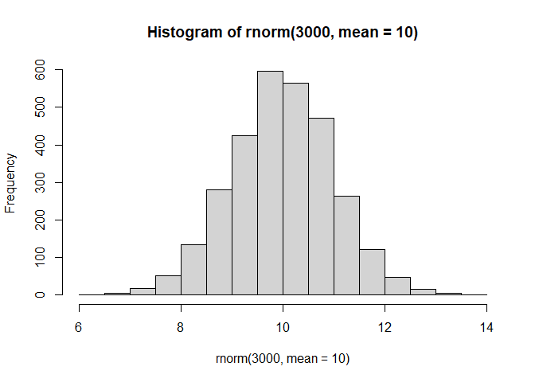
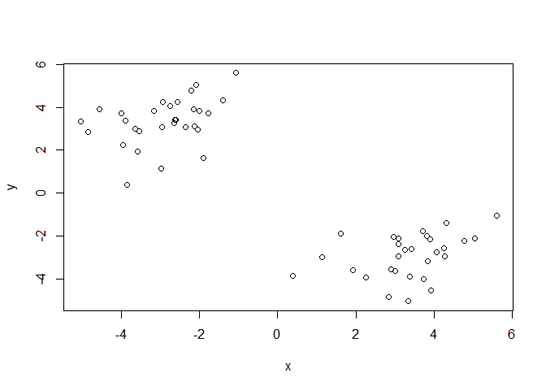
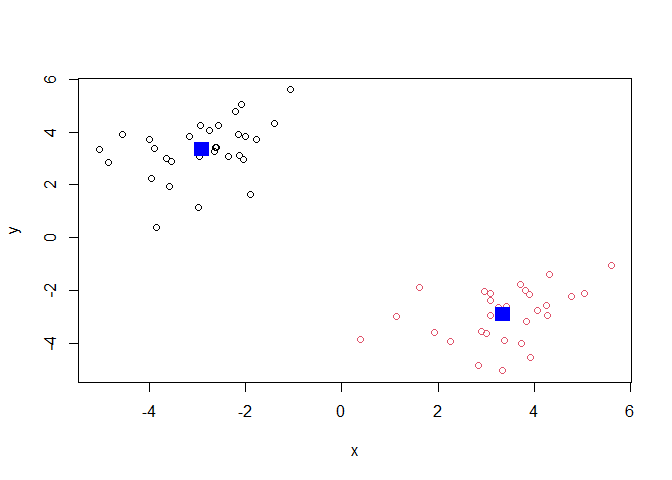
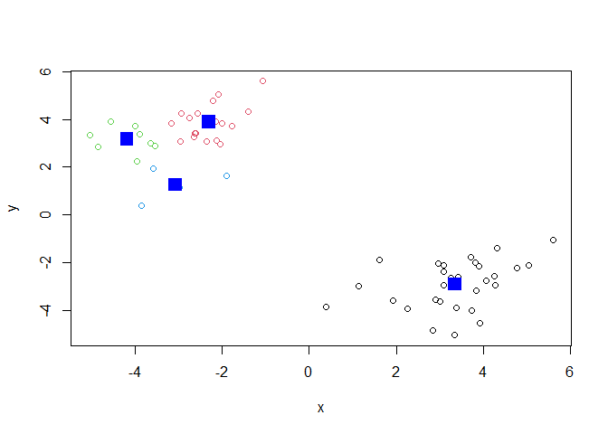
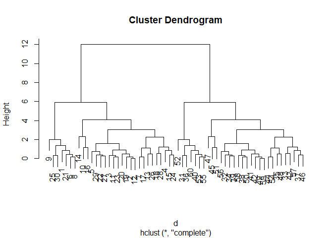
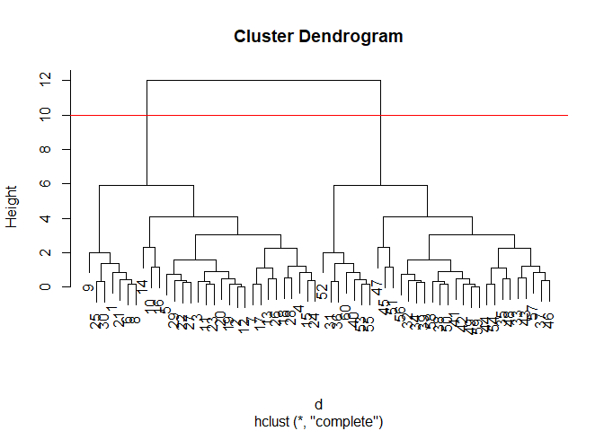
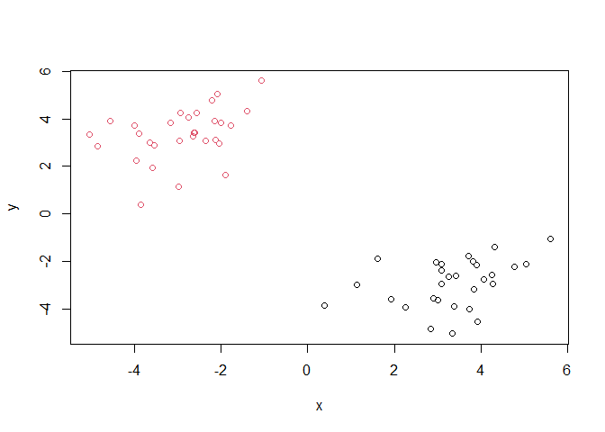
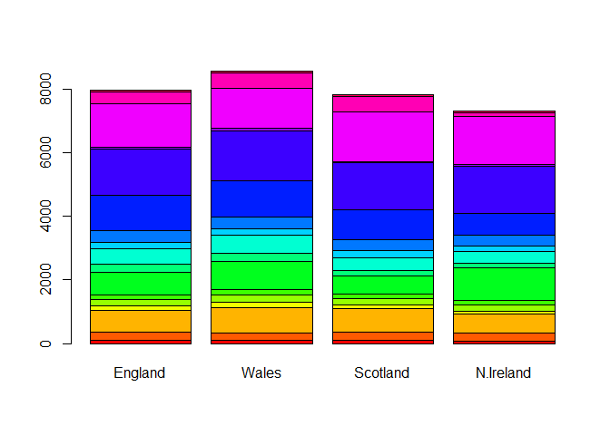

# Class 7: Machine Learning 1
Kris Price (PID: A17464127)

- [Background](#background)
- [K-means Clustering](#k-means-clustering)
- [Hierarchical clustering](#hierarchical-clustering)
- [Principal Component Analysis
  (PCA)](#principal-component-analysis-pca)
  - [PCA of UK food data](#pca-of-uk-food-data)
- [PCA to the Rescue](#pca-to-the-rescue)
- [Digging deeper (variable
  loadings)](#digging-deeper-variable-loadings)

## Background

Today we will begin our exploration of important machine learning
methods, with a focus on **clustering** and **dimensionality
reduction**.

To start testing these methods, let’s make up some sample data to
cluster where we know what the answer should be.

``` r
hist(rnorm(3000, mean = 10))
```



> Q. Can you generate 30 numbers centered at +3 & 30 numbers centered at
> -3 taken at random from a normal distribution?

``` r
tmp <- c(rnorm(30, 3),
         rnorm(30, -3))

x <- cbind(x = tmp, y = rev(tmp))
plot(x)
```



## K-means Clustering

The main function in “base R” for K-means clustering is called
`kmeans()`, let’s try it out.

``` r
k <- kmeans(x, centers = 2)
k
```

    K-means clustering with 2 clusters of sizes 30, 30

    Cluster means:
              x         y
    1 -2.909598  3.348120
    2  3.348120 -2.909598

    Clustering vector:
     [1] 2 2 2 2 2 2 2 2 2 2 2 2 2 2 2 2 2 2 2 2 2 2 2 2 2 2 2 2 2 2 1 1 1 1 1 1 1 1
    [39] 1 1 1 1 1 1 1 1 1 1 1 1 1 1 1 1 1 1 1 1 1 1

    Within cluster sum of squares by cluster:
    [1] 64.53224 64.53224
     (between_SS / total_SS =  90.1 %)

    Available components:

    [1] "cluster"      "centers"      "totss"        "withinss"     "tot.withinss"
    [6] "betweenss"    "size"         "iter"         "ifault"      

> Q. What component of your k-means result object has the cluster
> centers?

``` r
k$centers
```

              x         y
    1 -2.909598  3.348120
    2  3.348120 -2.909598

> Q. What component of your k-means result object has the cluster size
> (i.e. how many points are in each cluster)?

``` r
k$size
```

    [1] 30 30

> Q. What component of your k-means result object has the cluster
> membership vector (i.e. the main clustering result: which points are
> in which cluster)?

``` r
k$cluster
```

     [1] 2 2 2 2 2 2 2 2 2 2 2 2 2 2 2 2 2 2 2 2 2 2 2 2 2 2 2 2 2 2 1 1 1 1 1 1 1 1
    [39] 1 1 1 1 1 1 1 1 1 1 1 1 1 1 1 1 1 1 1 1 1 1

> Q. Plot the results of clustering (i.e. our data colored by the
> clustering result) along with the cluster centers.

``` r
plot(x, col = k$cluster)
points(k$centers, col = "blue", pch = 15, cex = 2)
```



> Q. Can you run `kmeans()` again and cluster into 4 clusters and plot
> the results just like we did above with coloring by cluster & cluster
> centers shown in blue?

``` r
k4 <- kmeans(x, 4)
plot(x, col = k4$cluster)
points(k4$centers, col = "blue", pch = 15, cex = 2)
```



> **Key-point:** `kmeans()` will always return the clustering that we
> ask for (this is the “K” or “centers” in K-means)!

## Hierarchical clustering

The main function for hierarchical clustering in base R is called
`hclust()`. One of the main differences with respect to the `kmeans()`
function is that you cannot just pass your input data directly to
`hclust()` - it needs a “distance matrix” as input. We can get this from
lots of places, including the `dist()` function.

``` r
d <- dist(x)
hc <- hclust(d)
plot(hc)
```



We can “cut” the dendogram or “tree” at a given height to yield our
clusters. For this, we use the function `cutree()`

``` r
plot(hc)
abline(h = 10, col = "red")
```



``` r
groups <- cutree(hc, h = 10)
```

> Q. Plot our data `x` colored by the clustering result from `hclust()`
> and `cutree()`?

``` r
plot(x, col = groups)
```



## Principal Component Analysis (PCA)

PCA is a popular dimensionality reduction technique that is widely used
in bioinformatics.

### PCA of UK food data

Read data on food consumption in the UK:

``` r
url <- "https://tinyurl.com/UK-foods"
x <- read.csv(url)
x
```

                         X England Wales Scotland N.Ireland
    1               Cheese     105   103      103        66
    2        Carcass_meat      245   227      242       267
    3          Other_meat      685   803      750       586
    4                 Fish     147   160      122        93
    5       Fats_and_oils      193   235      184       209
    6               Sugars     156   175      147       139
    7      Fresh_potatoes      720   874      566      1033
    8           Fresh_Veg      253   265      171       143
    9           Other_Veg      488   570      418       355
    10 Processed_potatoes      198   203      220       187
    11      Processed_Veg      360   365      337       334
    12        Fresh_fruit     1102  1137      957       674
    13            Cereals     1472  1582     1462      1494
    14           Beverages      57    73       53        47
    15        Soft_drinks     1374  1256     1572      1506
    16   Alcoholic_drinks      375   475      458       135
    17      Confectionery       54    64       62        41

It looks like the row names are not set properly. We can fix this:

``` r
# rownames(x) <- x[, 1]
# x <- x[, -1]
```

A better way to do this is fix the row names assignment at import time:

``` r
x <- read.csv(url, row.names = 1)
```

> Q1. How many rows and columns are in your new data frame named x? What
> R functions could you use to answer this questions?

``` r
dim(x)
```

    [1] 17  4

There are 17 rows and 4 columns in x. You could use `dim(x)` or a
combination of `nrow()` and `ncol()`.

> Q2. Which approach to solving the ‘row-names problem’ mentioned above
> do you prefer and why? Is one approach more robust than another under
> certain circumstances?

I prefer solving the ‘row-names problem’ while importing the csv file
because if you re-run the `x <- x[, -1]` code, it will continuously
delete the first column. If you re-run
`x <- read.csv(url, row.names = 1)`, this issue will not happen.

> Q3: Changing what optional argument in the above barplot() function
> results in the following plot?

You can change the `beside` argument to FALSE instead of TRUE:

``` r
barplot(as.matrix(x), beside=F, col=rainbow(nrow(x)))
```



> Q5: We can use the pairs() function to generate all pairwise plots for
> our countries. Can you make sense of the following code and resulting
> figure? What does it mean if a given point lies on the diagonal for a
> given plot?

``` r
pairs(x, col=rainbow(nrow(x)), pch=16)
```


If a given point lies on the diagonal for a plot, that means that the
two countries that are being plotted eat similar amounts of a food
category. If a point is away from the diagonal, then the two countries
eat more different amounts of a food category.

> Q6. Based on the pairs and heatmap figures, which countries cluster
> together and what does this suggest about their food consumption
> patterns? Can you easily tell what the main differences between N.
> Ireland and the other countries of the UK in terms of this data-set?

I think that England, Wales, and Scotland cluster together the most,
which suggests that they have similar food consumption habits. I can
only tell what the main differences between N. Ireland and the other
countries are in the heatmap, but not very easily.

We can install the **pheatmap** package with the `install.packages()`
command that we used previously. Remember that we always run this in the
console and not a code chunk in our Quarto document.

``` r
library(pheatmap)

pheatmap(as.matrix(x))
```


Of all these plots, only the `pairs()` plot was useful. This, however
took a bit of work to interpret and will not scale when I am looking at
much bigger datasets.

## PCA to the Rescue

The main function in “base R” for PCA is called `prcomp()`

``` r
pca <- prcomp(t(x))
summary(pca)
```

    Importance of components:
                                PC1      PC2      PC3       PC4
    Standard deviation     324.1502 212.7478 73.87622 3.176e-14
    Proportion of Variance   0.6744   0.2905  0.03503 0.000e+00
    Cumulative Proportion    0.6744   0.9650  1.00000 1.000e+00

> Q. How much variance is capturned in the first PC?

67.44% of variance.

> Q. How many PCs do I need to capture at least 90% of the total
> variance in the dataset?

Two PCs capture 96.5% of the total variance.

> Q. Plot our main PCA result. This is called different things depending
> on field of study (e.g. “PC plot”, “ordination plot”, “score plot”,
> “PC1 vs. PC2 plot”)

``` r
attributes(pca)
```

    $names
    [1] "sdev"     "rotation" "center"   "scale"    "x"       

    $class
    [1] "prcomp"

To generate our PCA score plot, we want the `pca$x` component of the
result object.

``` r
pca$x
```

                     PC1         PC2        PC3           PC4
    England   -144.99315   -2.532999 105.768945 -4.894696e-14
    Wales     -240.52915 -224.646925 -56.475555  5.700024e-13
    Scotland   -91.86934  286.081786 -44.415495 -7.460785e-13
    N.Ireland  477.39164  -58.901862  -4.877895  2.321303e-13

``` r
my_cols <- c("orange", "red", "blue", "darkgreen")
plot(pca$x[, 1], pca$x[, 2], col = my_cols, pch = 16)
```


``` r
library(ggplot2)

ggplot(pca$x) +
  aes(PC1, PC2) +
  geom_point(col = my_cols)
```


## Digging deeper (variable loadings)

How do the original variables (i.e. the 17 different foods) contribute
to our new PCs?

``` r
ggplot(pca$rotation) +
  aes(x = PC1, 
      y = reorder(rownames(pca$rotation), PC1)) +
  geom_col(fill = "steelblue") +
  xlab("PC1 Loading Score") +
  ylab("") +
  theme_bw() +
  theme(axis.text.y = element_text(size = 9))
```


> Q9: Generate a similar ‘loadings plot’ for PC2. What two food groups
> feature prominantely and what does PC2 maninly tell us about?

``` r
ggplot(pca$rotation) +
  aes(x = PC2, 
      y = reorder(rownames(pca$rotation), PC2)) +
  geom_col(fill = "steelblue") +
  xlab("PC2 Loading Score") +
  ylab("") +
  theme_bw() +
  theme(axis.text.y = element_text(size = 9))
```


Soft drinks and fresh potatoes feature most prominently. PC2 tells us
that these two groups greatly drive 29.05% of the total variation.
