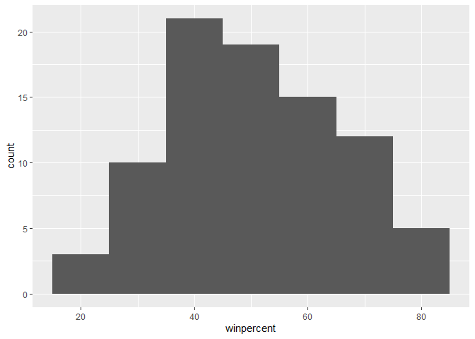
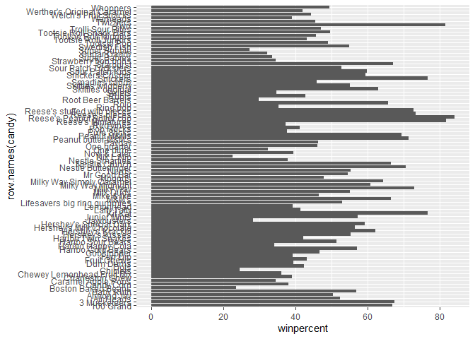
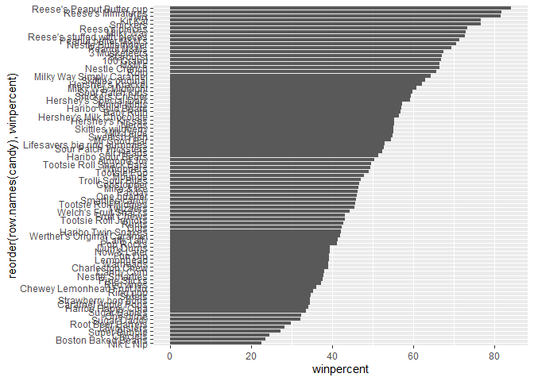
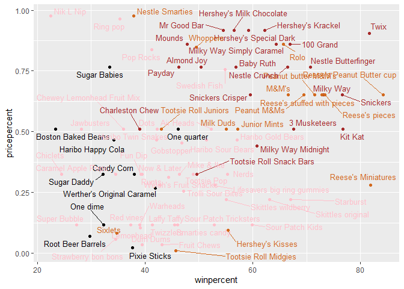
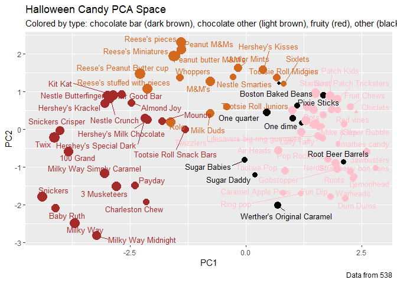

# Class 09: Candy Mini Project
Kris Price (PID: A17464127)

- [Importing Candy Data](#importing-candy-data)
  - [What is in the dataset?](#what-is-in-the-dataset)
  - [What is your favorite candy?](#what-is-your-favorite-candy)
- [Exploratory Analysis](#exploratory-analysis)
- [Overall Candy Rankings](#overall-candy-rankings)
  - [Time to add some useful color](#time-to-add-some-useful-color)
- [Taking a look at pricepercent](#taking-a-look-at-pricepercent)
- [Exploring the correlation
  structure](#exploring-the-correlation-structure)
- [Principal Component Analysis](#principal-component-analysis)
- [Summary](#summary)
- [Optional extension questions](#optional-extension-questions)

## Importing Candy Data

Our dataset is a CSV file so we use `read.csv()`

``` r
candy <- read.csv("candy-data.csv", row.names = 1)
head(candy)
```

                 chocolate fruity caramel peanutyalmondy nougat crispedricewafer
    100 Grand            1      0       1              0      0                1
    3 Musketeers         1      0       0              0      1                0
    One dime             0      0       0              0      0                0
    One quarter          0      0       0              0      0                0
    Air Heads            0      1       0              0      0                0
    Almond Joy           1      0       0              1      0                0
                 hard bar pluribus sugarpercent pricepercent winpercent
    100 Grand       0   1        0        0.732        0.860   66.97173
    3 Musketeers    0   1        0        0.604        0.511   67.60294
    One dime        0   0        0        0.011        0.116   32.26109
    One quarter     0   0        0        0.011        0.511   46.11650
    Air Heads       0   0        0        0.906        0.511   52.34146
    Almond Joy      0   1        0        0.465        0.767   50.34755

### What is in the dataset?

> Q1. How many different candy types are in this dataset?

``` r
nrow(candy)
```

    [1] 85

There are 85 candies.

> Q2. How many fruity candy types are in the dataset?

``` r
table(candy$fruity)
```


     0  1 
    47 38 

There are 38 fruity candies.

### What is your favorite candy?

> Q3. What is your favorite candy (other than Twix) in the dataset and
> what is it’s winpercent value?

``` r
library(dplyr)
```


    Attaching package: 'dplyr'

    The following objects are masked from 'package:stats':

        filter, lag

    The following objects are masked from 'package:base':

        intersect, setdiff, setequal, union

``` r
candy %>%
  filter(row.names(candy) == "Sour Patch Kids") %>%
  select(winpercent)
```

                    winpercent
    Sour Patch Kids     59.864

Sour Patch Kids have a winpercent value of 59.864.

> Q4. What is the winpercent value for “Kit Kat”?

``` r
candy %>%
  filter(row.names(candy) == "Kit Kat") %>%
  select(winpercent)
```

            winpercent
    Kit Kat    76.7686

Kit Kats have a winpercent value of 76.7686.

> Q5. What is the winpercent value for “Tootsie Roll Snack Bars”?

``` r
candy %>%
  filter(row.names(candy) == "Tootsie Roll Snack Bars") %>%
  select(winpercent)
```

                            winpercent
    Tootsie Roll Snack Bars    49.6535

Tootsie Roll Snack Bars have a winpercent value of 49.6535.

There is a useful skim() function in the skimr package that can help
give you a quick overview of a given dataset. Let’s install this package
using `install.packages("skimr")` and try it on our candy data.

``` r
#library(skimr)
#skim(candy)
```

> Q6. Is there any variable/column that looks to be on a different scale
> to the majority of the other columns in the dataset?

The `winpercent` variable is the only one that’s not on a scale from
0-1.

> Q7. What do you think a zero and one represent for the
> candy\$chocolate column?

The `candy$chocolate` column has binary values: 0 means that the candy
isn’t chocolate, while 1 means that the candy is chocolate.

## Exploratory Analysis

> Q8. Plot a histogram of winpercent values

Using base R:

``` r
hist(candy$winpercent)
```


Using ggplot2:

``` r
library(ggplot2)

ggplot(candy, aes(x = winpercent)) +
  geom_histogram(binwidth = 10)
```



> Q9. Is the distribution of winpercent values symmetrical?

The distribution is not symmetrical (it’s right-skewed).

> Q10. Is the center of the distribution above or below 50%?

``` r
summary(candy$winpercent)
```

       Min. 1st Qu.  Median    Mean 3rd Qu.    Max. 
      22.45   39.14   47.83   50.32   59.86   84.18 

The center of this distribution is below 50% (median = 47.83).

> Q11. On average is chocolate candy higher or lower ranked than fruit
> candy?

``` r
candy_c <- candy %>%
  filter(chocolate == 1)
summary(candy_c$winpercent)
```

       Min. 1st Qu.  Median    Mean 3rd Qu.    Max. 
      34.72   50.35   60.80   60.92   70.74   84.18 

``` r
candy_f <- candy %>%
  filter(fruity == 1)
summary(candy_f$winpercent)
```

       Min. 1st Qu.  Median    Mean 3rd Qu.    Max. 
      22.45   39.04   42.97   44.12   52.11   67.04 

On average, chocolate candy (mean = 60.92) is higher-ranked than fruit
candy (mean 44.12).

> Q12. Is this difference statistically significant?

``` r
t.test(candy_c$winpercent, candy_f$winpercent)
```


        Welch Two Sample t-test

    data:  candy_c$winpercent and candy_f$winpercent
    t = 6.2582, df = 68.882, p-value = 2.871e-08
    alternative hypothesis: true difference in means is not equal to 0
    95 percent confidence interval:
     11.44563 22.15795
    sample estimates:
    mean of x mean of y 
     60.92153  44.11974 

Yes, this difference is statistically significant (p \< 0.05).

## Overall Candy Rankings

> Q13. What are the five least liked candy types in this set?

``` r
low <- candy %>%
  arrange(winpercent)
head(low, 5)
```

                       chocolate fruity caramel peanutyalmondy nougat
    Nik L Nip                  0      1       0              0      0
    Boston Baked Beans         0      0       0              1      0
    Chiclets                   0      1       0              0      0
    Super Bubble               0      1       0              0      0
    Jawbusters                 0      1       0              0      0
                       crispedricewafer hard bar pluribus sugarpercent pricepercent
    Nik L Nip                         0    0   0        1        0.197        0.976
    Boston Baked Beans                0    0   0        1        0.313        0.511
    Chiclets                          0    0   0        1        0.046        0.325
    Super Bubble                      0    0   0        0        0.162        0.116
    Jawbusters                        0    1   0        1        0.093        0.511
                       winpercent
    Nik L Nip            22.44534
    Boston Baked Beans   23.41782
    Chiclets             24.52499
    Super Bubble         27.30386
    Jawbusters           28.12744

Nik L Nip, Boston Baked Beans, Chiclets, Super Bubble, Jawbusters.

> Q14. What are the top 5 all time favorite candy types out of this set?

``` r
high <- candy %>%
  arrange(desc(winpercent))

head(high, 5)
```

                              chocolate fruity caramel peanutyalmondy nougat
    Reese's Peanut Butter cup         1      0       0              1      0
    Reese's Miniatures                1      0       0              1      0
    Twix                              1      0       1              0      0
    Kit Kat                           1      0       0              0      0
    Snickers                          1      0       1              1      1
                              crispedricewafer hard bar pluribus sugarpercent
    Reese's Peanut Butter cup                0    0   0        0        0.720
    Reese's Miniatures                       0    0   0        0        0.034
    Twix                                     1    0   1        0        0.546
    Kit Kat                                  1    0   1        0        0.313
    Snickers                                 0    0   1        0        0.546
                              pricepercent winpercent
    Reese's Peanut Butter cup        0.651   84.18029
    Reese's Miniatures               0.279   81.86626
    Twix                             0.906   81.64291
    Kit Kat                          0.511   76.76860
    Snickers                         0.651   76.67378

Reese’s Peanut Butter cup, Reese’s Miniatures, Twix, Kit Kat, Snickers.

> Q15. Make a first barplot of candy ranking based on winpercent values.

``` r
ggplot(candy, aes(winpercent, row.names(candy))) +
  geom_col()
```



> Q16. This is quite ugly, use the `reorder()` function to get the bars
> sorted by `winpercent`?

``` r
ggplot(candy, aes(winpercent, reorder(row.names(candy), winpercent))) +
  geom_col()
```



### Time to add some useful color

``` r
my_cols=rep("black", nrow(candy))
my_cols[as.logical(candy$chocolate)] = "chocolate"
my_cols[as.logical(candy$bar)] = "brown"
my_cols[as.logical(candy$fruity)] = "pink"
```

``` r
ggplot(candy) + 
  aes(winpercent, reorder(rownames(candy),winpercent)) +
  geom_col(fill=my_cols) 
```


> Q17. What is the worst ranked chocolate candy?

Sixlets are the worst-ranked chocolate candy.

> Q18. What is the best ranked fruity candy?

Starburst is the best-ranked fruity candy.

## Taking a look at pricepercent

``` r
library(ggrepel)

# How about a plot of win vs price
ggplot(candy) +
  aes(winpercent, pricepercent, label=rownames(candy)) +
  geom_point(col=my_cols) + 
  geom_text_repel(col=my_cols, size=3.3, max.overlaps = 17)
```



> Q19. Which candy type is the highest ranked in terms of winpercent for
> the least money - i.e. offers the most bang for your buck?

Reese’s Miniatures.

> Q20. What are the top 5 most expensive candy types in the dataset and
> of these which is the least popular?

``` r
price <- candy %>%
  arrange(desc(pricepercent))

head(price, 5)
```

                             chocolate fruity caramel peanutyalmondy nougat
    Nik L Nip                        0      1       0              0      0
    Nestle Smarties                  1      0       0              0      0
    Ring pop                         0      1       0              0      0
    Hershey's Krackel                1      0       0              0      0
    Hershey's Milk Chocolate         1      0       0              0      0
                             crispedricewafer hard bar pluribus sugarpercent
    Nik L Nip                               0    0   0        1        0.197
    Nestle Smarties                         0    0   0        1        0.267
    Ring pop                                0    1   0        0        0.732
    Hershey's Krackel                       1    0   1        0        0.430
    Hershey's Milk Chocolate                0    0   1        0        0.430
                             pricepercent winpercent
    Nik L Nip                       0.976   22.44534
    Nestle Smarties                 0.976   37.88719
    Ring pop                        0.965   35.29076
    Hershey's Krackel               0.918   62.28448
    Hershey's Milk Chocolate        0.918   56.49050

Nik L Nips is the most expensive AND least popular candy in this
dataset.

## Exploring the correlation structure

Using the `corrplot` package (install first using
`install.packages("corrplot")`):

``` r
library(corrplot)
```

    corrplot 0.95 loaded

``` r
cij <- cor(candy)
corrplot(cij)
```


> Q22. Examining this plot what two variables are anti-correlated
> (i.e. have minus values)?

Chocolate and fruity are anti-correlated. Additionally, pluribus and bar
are also anti-correlated.

> Q23. Similarly, what two variables are most positively correlated?

Chocolate and bar are the most positively correlated variables.

## Principal Component Analysis

``` r
pca <- prcomp(candy, scale = TRUE)
summary(pca)
```

    Importance of components:
                              PC1    PC2    PC3     PC4    PC5     PC6     PC7
    Standard deviation     2.0788 1.1378 1.1092 1.07533 0.9518 0.81923 0.81530
    Proportion of Variance 0.3601 0.1079 0.1025 0.09636 0.0755 0.05593 0.05539
    Cumulative Proportion  0.3601 0.4680 0.5705 0.66688 0.7424 0.79830 0.85369
                               PC8     PC9    PC10    PC11    PC12
    Standard deviation     0.74530 0.67824 0.62349 0.43974 0.39760
    Proportion of Variance 0.04629 0.03833 0.03239 0.01611 0.01317
    Cumulative Proportion  0.89998 0.93832 0.97071 0.98683 1.00000

``` r
plot(pca$x[, 1:2], col = my_cols, pch = 16)
```


Using `ggplot2` and `ggrepel` packages:

``` r
my_data <- cbind(candy, pca$x[,1:3])

p <- ggplot(my_data) + 
        aes(x=PC1, y=PC2, 
            size=winpercent/100,  
            text=rownames(my_data),
            label=rownames(my_data)) +
        geom_point(col=my_cols)

p + geom_text_repel(size=3.3, col=my_cols, max.overlaps = 17)  + 
  theme(legend.position = "none") +
  labs(title="Halloween Candy PCA Space",
       subtitle="Colored by type: chocolate bar (dark brown), chocolate other (light brown), fruity (red), other (black)",
       caption="Data from 538")
```



``` r
ggplot(pca$rotation) +
  aes(PC1, reorder(row.names(pca$rotation), PC1)) +
  geom_col()
```


> Q24. Complete the code to generate the loadings plot above. What
> original variables are picked up strongly by PC1 in the positive
> direction? Do these make sense to you? Where did you see this
> relationship highlighted previously?

Fruity and pluribus are picked up strongly by PC1 in the positive
direction. Given that I previously found the strongest anti-correlations
between fruity & chocolate and pluribus & bar, this makes sense to me.

## Summary

> Q25. Based on your exploratory analysis, correlation findings, and PCA
> results, what combination of characteristics appears to make a
> “winning” candy? How do these different analyses (visualization,
> correlation, PCA) support or complement each other in reaching this
> conclusion?

The combination of characteristics that seem to make a “winning” candy
is chocolate + bar.

From the barplot visualizations, you can qualitatively see that most of
the chocolate/bar candies are at the top (where winpercent is highest).

From the correlation plot, you can see that winpercent is most
positively correlated with chocolate, and in turn chocolate is also
strongly positively correlated with bar.

From the PCA, you can see that candies that are chocolate bars make up
their own cluster, and are picked up strongly by PC1 in the same
direction as winpercent.

## Optional extension questions

``` r
losers = candy[which(candy$winpercent < 50),]
winners = candy[which(candy$winpercent >= 50),]
```

> Q26. Are popular candies more expensive? In other words: is price
> significantly different between “winners” and “losers”? List both
> average values and a P-value along with your answer.

``` r
summary(losers$pricepercent)
```

       Min. 1st Qu.  Median    Mean 3rd Qu.    Max. 
     0.0110  0.1160  0.3250  0.3744  0.5110  0.9760 

``` r
summary(winners$pricepercent)
```

       Min. 1st Qu.  Median    Mean 3rd Qu.    Max. 
     0.0930  0.4530  0.6510  0.5804  0.7670  0.9180 

``` r
t.test(losers$pricepercent, winners$pricepercent)
```


        Welch Two Sample t-test

    data:  losers$pricepercent and winners$pricepercent
    t = -3.5653, df = 82.798, p-value = 0.0006068
    alternative hypothesis: true difference in means is not equal to 0
    95 percent confidence interval:
     -0.32090727 -0.09107157
    sample estimates:
    mean of x mean of y 
    0.3743696 0.5803590 

“Losers” have an average price percent of 37.44%, while “winners” have
an average price percent of 58.04%. Conducting a t-test comparing the
price percents of both groups returns a p-value \< 0.05, suggesting that
popular candies are significantly more expensive than “loser” candies.

> Q27. Are candies with more sugar more likely to be popular? What is
> your interpretation of the means and P-value in this case?

``` r
non_sugary <- candy[which(candy$sugarpercent < 0.50),]
sugary <- candy[which(candy$sugarpercent > 0.50),]

t.test(non_sugary$winpercent, sugary$winpercent)
```


        Welch Two Sample t-test

    data:  non_sugary$winpercent and sugary$winpercent
    t = -2.1192, df = 76.967, p-value = 0.0373
    alternative hypothesis: true difference in means is not equal to 0
    95 percent confidence interval:
     -13.0167630  -0.4050308
    sample estimates:
    mean of x mean of y 
     47.23765  53.94854 

Yes, candies with more sugar are likely to be more popular. Sugary
candies have an average winpercent of 53.95%, while candies with less
sugar have an average winpercent of 47.24%. Conducting a t-test reports
a p-value \< 0.05, suggesting that sugary candies are significantly more
popular than non-sugary candies.
