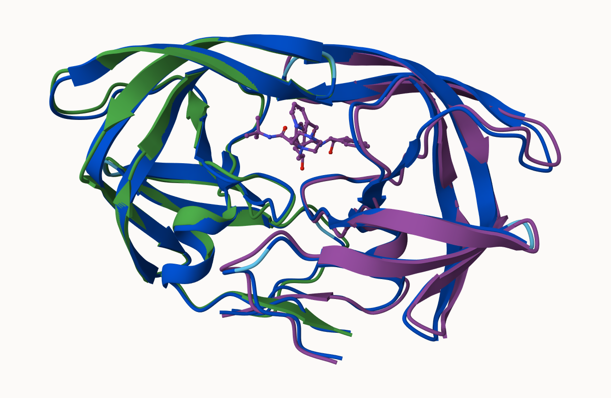
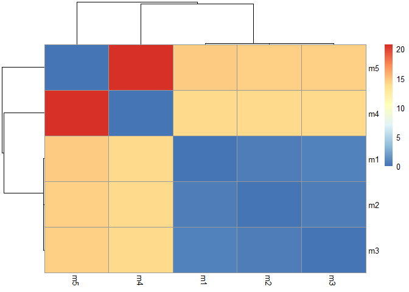
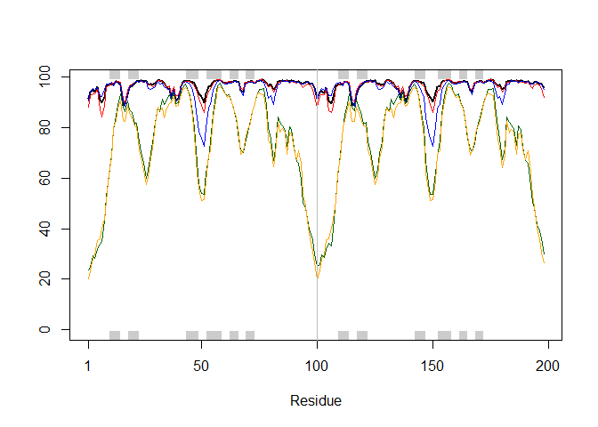
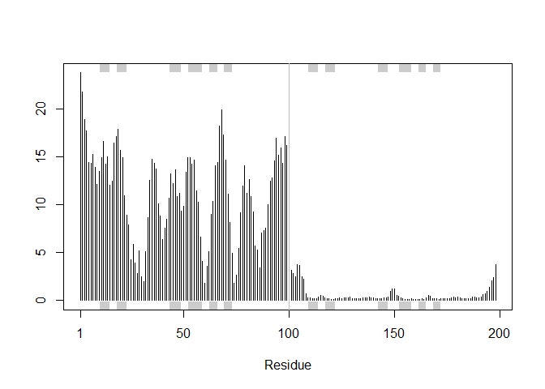
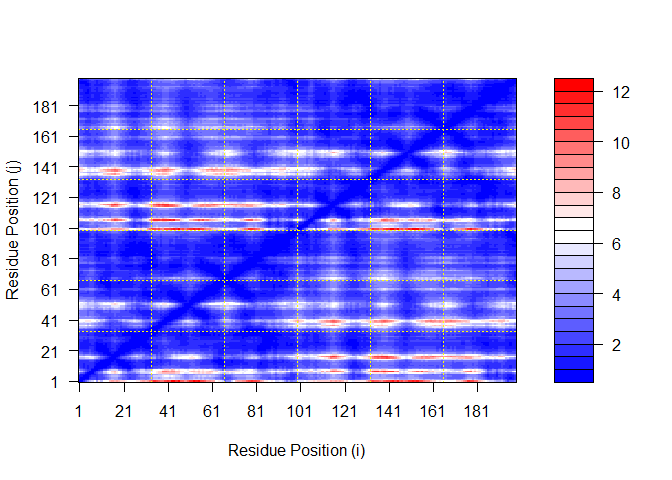
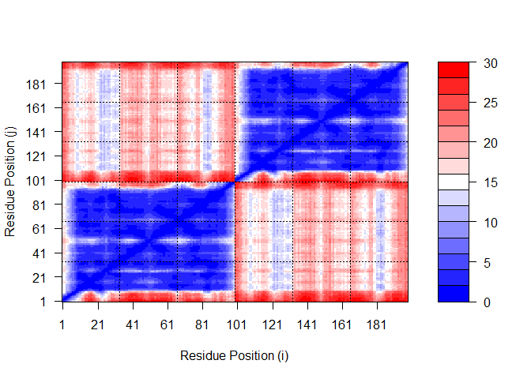
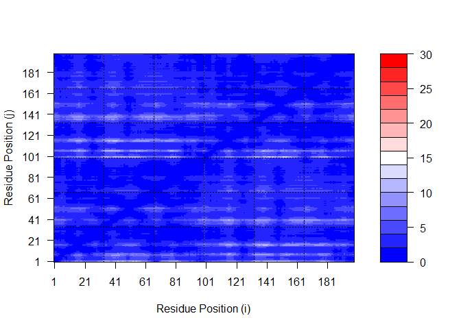
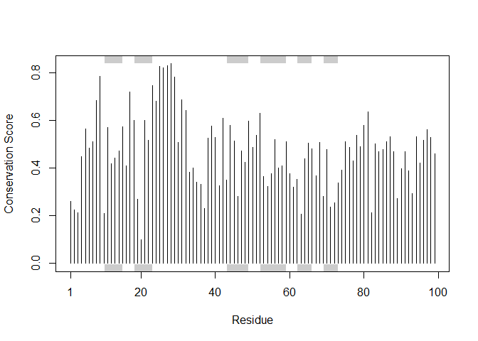

# Class 11: Protein Structure Prediction with AlphaFold
Kris Price (PID: A17464127)

- [Background](#background)
- [The EBI AlphaFold Database](#the-ebi-alphafold-database)
- [Running AlphaFold](#running-alphafold)
- [Interpreting Results](#interpreting-results)
- [Custom analysis of resulting
  models](#custom-analysis-of-resulting-models)
  - [Plotting pLDDT values](#plotting-plddt-values)
  - [Plotting RMSF](#plotting-rmsf)
  - [Plotting PAE for domains](#plotting-pae-for-domains)
  - [Residue conservation from alignment
    file](#residue-conservation-from-alignment-file)

## Background

We saw last time that the main repository for biomolecular structures
(the PDB database) only has ~250,000 entries.

UniProtKB (the main protein sequence database) has over 200 million
entries!

In this hands-on session we will utilize AlphaFold to predict protein
structure from sequence (Jumper et al. 2021).

Without the aid of such approaches, it can take years of expensive
laboratory work to determine the structure of just one protein. With
AlphaFold we can now accurately compute a typical protein structure in
as little as ten minutes.

## The EBI AlphaFold Database

The EBI alphafold database contains lots of computed structure models.
It is increasingly likely that the structure you are interested in is
already in this database at \< https://alphafold.ebi.ac.uk \>

There are 3 major outputs from AlphaFold

1.  A model of structure in **PDB** format.
2.  A **pLDDT score**: that tells us how confident the model is for a
    given residue in your protein (High values are good, above 70).
3.  A **PAE score** that tells us about protein packing quality.

If you can’t find a matching entry for the sequence you are interested
in AFDB, you can run AlphaFold yourself…

## Running AlphaFold

We will use ColabFold to run AlphaFold on our sequence \<
https://github.com/sokrypton/ColabFold \>



## Interpreting Results

## Custom analysis of resulting models

We can read all the AlphaFold results into R and do more quantitative
analysis than just viewing the structures in Mol-star:

Read all the PDB models:

``` r
library(bio3d)

pdb_files <- list.files("hivpr_23119/", pattern = ".pdb", full.names = T)

pdbs <- pdbaln(pdb_files, fit=TRUE, exefile="msa")
```

    Reading PDB files:
    hivpr_23119/hivpr_23119_unrelaxed_rank_001_alphafold2_multimer_v3_model_4_seed_000.pdb
    hivpr_23119/hivpr_23119_unrelaxed_rank_002_alphafold2_multimer_v3_model_1_seed_000.pdb
    hivpr_23119/hivpr_23119_unrelaxed_rank_003_alphafold2_multimer_v3_model_5_seed_000.pdb
    hivpr_23119/hivpr_23119_unrelaxed_rank_004_alphafold2_multimer_v3_model_2_seed_000.pdb
    hivpr_23119/hivpr_23119_unrelaxed_rank_005_alphafold2_multimer_v3_model_3_seed_000.pdb
    .....

    Extracting sequences

    pdb/seq: 1   name: hivpr_23119/hivpr_23119_unrelaxed_rank_001_alphafold2_multimer_v3_model_4_seed_000.pdb 
    pdb/seq: 2   name: hivpr_23119/hivpr_23119_unrelaxed_rank_002_alphafold2_multimer_v3_model_1_seed_000.pdb 
    pdb/seq: 3   name: hivpr_23119/hivpr_23119_unrelaxed_rank_003_alphafold2_multimer_v3_model_5_seed_000.pdb 
    pdb/seq: 4   name: hivpr_23119/hivpr_23119_unrelaxed_rank_004_alphafold2_multimer_v3_model_2_seed_000.pdb 
    pdb/seq: 5   name: hivpr_23119/hivpr_23119_unrelaxed_rank_005_alphafold2_multimer_v3_model_3_seed_000.pdb 

``` r
# library(bio3dview)
# view.pdbs(pdbs)
```

How similar or different are my models?

``` r
rd <- rmsd(pdbs)
```

    Warning in rmsd(pdbs): No indices provided, using the 198 non NA positions

``` r
library(pheatmap)

colnames(rd) <- paste0("m",1:5)
rownames(rd) <- paste0("m",1:5)
pheatmap(rd)
```



### Plotting pLDDT values

We can also plot the pLDDT values across all models, using `1hsg` as the
reference PDB structure:

``` r
pdb <- read.pdb("1hsg")
```

      Note: Accessing on-line PDB file

``` r
plotb3(pdbs$b[1,], typ="l", lwd=2, sse=pdb)
points(pdbs$b[2,], typ="l", col="red")
points(pdbs$b[3,], typ="l", col="blue")
points(pdbs$b[4,], typ="l", col="darkgreen")
points(pdbs$b[5,], typ="l", col="orange")
abline(v=100, col="gray")
```



Using the `core.find()` function, we can improve the superimposing of
our models:

``` r
core <- core.find(pdbs)
```

     core size 197 of 198  vol = 5309.844 
     core size 196 of 198  vol = 4627.756 
     core size 195 of 198  vol = 1808.542 
     core size 194 of 198  vol = 1110.325 
     core size 193 of 198  vol = 1036.999 
     core size 192 of 198  vol = 988.736 
     core size 191 of 198  vol = 943.269 
     core size 190 of 198  vol = 900.421 
     core size 189 of 198  vol = 859.943 
     core size 188 of 198  vol = 826.478 
     core size 187 of 198  vol = 795.526 
     core size 186 of 198  vol = 766.278 
     core size 185 of 198  vol = 742.924 
     core size 184 of 198  vol = 719.151 
     core size 183 of 198  vol = 692.619 
     core size 182 of 198  vol = 672.495 
     core size 181 of 198  vol = 636.289 
     core size 180 of 198  vol = 617.537 
     core size 179 of 198  vol = 601.098 
     core size 178 of 198  vol = 585.157 
     core size 177 of 198  vol = 570.278 
     core size 176 of 198  vol = 555.83 
     core size 175 of 198  vol = 537.49 
     core size 174 of 198  vol = 524.675 
     core size 173 of 198  vol = 495.763 
     core size 172 of 198  vol = 481.844 
     core size 171 of 198  vol = 468.081 
     core size 170 of 198  vol = 451.242 
     core size 169 of 198  vol = 435.308 
     core size 168 of 198  vol = 422.056 
     core size 167 of 198  vol = 412.292 
     core size 166 of 198  vol = 399.956 
     core size 165 of 198  vol = 388.98 
     core size 164 of 198  vol = 375.639 
     core size 163 of 198  vol = 364.465 
     core size 162 of 198  vol = 350.288 
     core size 161 of 198  vol = 338.353 
     core size 160 of 198  vol = 326.352 
     core size 159 of 198  vol = 315.613 
     core size 158 of 198  vol = 303.717 
     core size 157 of 198  vol = 292.851 
     core size 156 of 198  vol = 281.894 
     core size 155 of 198  vol = 272.825 
     core size 154 of 198  vol = 263.9 
     core size 153 of 198  vol = 254.532 
     core size 152 of 198  vol = 245.304 
     core size 151 of 198  vol = 232.755 
     core size 150 of 198  vol = 219.782 
     core size 149 of 198  vol = 212.141 
     core size 148 of 198  vol = 204.358 
     core size 147 of 198  vol = 194.203 
     core size 146 of 198  vol = 186.465 
     core size 145 of 198  vol = 178.938 
     core size 144 of 198  vol = 170.746 
     core size 143 of 198  vol = 163.125 
     core size 142 of 198  vol = 152.646 
     core size 141 of 198  vol = 142.954 
     core size 140 of 198  vol = 136.886 
     core size 139 of 198  vol = 131.538 
     core size 138 of 198  vol = 124.104 
     core size 137 of 198  vol = 117.076 
     core size 136 of 198  vol = 109.637 
     core size 135 of 198  vol = 104.686 
     core size 134 of 198  vol = 98.656 
     core size 133 of 198  vol = 94.775 
     core size 132 of 198  vol = 90.581 
     core size 131 of 198  vol = 87.528 
     core size 130 of 198  vol = 83.823 
     core size 129 of 198  vol = 79.49 
     core size 128 of 198  vol = 75.67 
     core size 127 of 198  vol = 71.939 
     core size 126 of 198  vol = 68.448 
     core size 125 of 198  vol = 64.991 
     core size 124 of 198  vol = 62.247 
     core size 123 of 198  vol = 58.392 
     core size 122 of 198  vol = 54.311 
     core size 121 of 198  vol = 49.693 
     core size 120 of 198  vol = 46.953 
     core size 119 of 198  vol = 43.668 
     core size 118 of 198  vol = 40.216 
     core size 117 of 198  vol = 37.439 
     core size 116 of 198  vol = 34.569 
     core size 115 of 198  vol = 31.7 
     core size 114 of 198  vol = 29.011 
     core size 113 of 198  vol = 26.393 
     core size 112 of 198  vol = 24.385 
     core size 111 of 198  vol = 22.524 
     core size 110 of 198  vol = 20.745 
     core size 109 of 198  vol = 19.132 
     core size 108 of 198  vol = 17.455 
     core size 107 of 198  vol = 15.711 
     core size 106 of 198  vol = 13.847 
     core size 105 of 198  vol = 12.549 
     core size 104 of 198  vol = 11.326 
     core size 103 of 198  vol = 10.405 
     core size 102 of 198  vol = 8.999 
     core size 101 of 198  vol = 8.15 
     core size 100 of 198  vol = 7.152 
     core size 99 of 198  vol = 5.997 
     core size 98 of 198  vol = 5.182 
     core size 97 of 198  vol = 4.477 
     core size 96 of 198  vol = 3.609 
     core size 95 of 198  vol = 2.984 
     core size 94 of 198  vol = 2.691 
     core size 93 of 198  vol = 2.426 
     core size 92 of 198  vol = 2.134 
     core size 91 of 198  vol = 1.644 
     core size 90 of 198  vol = 1.297 
     core size 89 of 198  vol = 1.046 
     core size 88 of 198  vol = 0.863 
     core size 87 of 198  vol = 0.691 
     core size 86 of 198  vol = 0.544 
     core size 85 of 198  vol = 0.438 
     FINISHED: Min vol ( 0.5 ) reached

``` r
core.inds <- print(core, vol=0.5)
```

    # 86 positions (cumulative volume <= 0.5 Angstrom^3) 
      start end length
    1     9  50     42
    2    52  95     44

``` r
xyz <- pdbfit(pdbs, core.inds, outpath="corefit_structures")
```

### Plotting RMSF

We can examine the RMSF between positions of the structure. RMSF is
often used as a measure of conformational variance along the structure:

``` r
rf <- rmsf(xyz)

plotb3(rf, sse=pdb)
abline(v=100, col="gray", ylab="RMSF")
```



The second chain seems to be very similar across all models compared to
the first chain.

### Plotting PAE for domains

AlphaFold also outputs the Predicted Aligned Error (PAE) for each model
structure. These are contained in “.json” files, which we can read using
the `jsonlite` package:

``` r
library(jsonlite)

pae_files <- list.files(path="hivpr_23119",
                        pattern=".*model.*\\.json",
                        full.names = TRUE)
```

As an example, we can read and plot the 1st and 5th files against each
other:

``` r
pae1 <- read_json(pae_files[1],simplifyVector = TRUE)
pae5 <- read_json(pae_files[5],simplifyVector = TRUE)

attributes(pae1)
```

    $names
    [1] "plddt"   "max_pae" "pae"     "ptm"     "iptm"   

``` r
head(pae1$plddt)
```

    [1] 91.62 94.06 94.56 93.88 96.12 90.69

The maximum PAE values are useful for ranking models (the lower the PAE
score, the better. Here, we can see that model 5 is much worse than
model 1:

``` r
pae1$max_pae
```

    [1] 12.33594

``` r
pae5$max_pae
```

    [1] 29.45312

We can plot the N by N (where N is the number of residues) PAE scores
with `ggplot` or with functions from the `Bio3D` package. Here’s a plot
for model 1:

``` r
plot.dmat(pae1$pae, 
          xlab="Residue Position (i)",
          ylab="Residue Position (j)")
```



And here’s a plot for model 5:

``` r
plot.dmat(pae5$pae, 
          xlab="Residue Position (i)",
          ylab="Residue Position (j)",
          grid.col = "black",
          zlim=c(0,30))
```



Here’s the model 1 plot again, but using the same z range as the model 5
plot:

``` r
plot.dmat(pae1$pae, 
          xlab="Residue Position (i)",
          ylab="Residue Position (j)",
          grid.col = "black",
          zlim=c(0,30))
```



### Residue conservation from alignment file

``` r
aln_file <- list.files(path="hivpr_23119",
                       pattern=".a3m$",
                        full.names = TRUE)
aln_file
```

    [1] "hivpr_23119/hivpr_23119.a3m"

``` r
aln <- read.fasta(aln_file[1], to.upper = TRUE)
```

    [1] " ** Duplicated sequence id's: 101 **"
    [2] " ** Duplicated sequence id's: 101 **"

We can find the number of sequences in this alignment using the `dim()`
function:

``` r
dim(aln$ali)
```

    [1] 5397  132

We can also score residue conservation in the alignment with the
`conserv()` function:

``` r
sim <- conserv(aln)

plotb3(sim[1:99], sse=trim.pdb(pdb, chain="A"),
       ylab="Conservation Score")
```



The most-conserved residues seem to be in the 20th-30th positions! These
positions will stand out even more if we generate a consensus sequence
with a very high cut-off value:

``` r
con <- consensus(aln, cutoff = 0.9)
con$seq
```

      [1] "-" "-" "-" "-" "-" "-" "-" "-" "-" "-" "-" "-" "-" "-" "-" "-" "-" "-"
     [19] "-" "-" "-" "-" "-" "-" "D" "T" "G" "A" "-" "-" "-" "-" "-" "-" "-" "-"
     [37] "-" "-" "-" "-" "-" "-" "-" "-" "-" "-" "-" "-" "-" "-" "-" "-" "-" "-"
     [55] "-" "-" "-" "-" "-" "-" "-" "-" "-" "-" "-" "-" "-" "-" "-" "-" "-" "-"
     [73] "-" "-" "-" "-" "-" "-" "-" "-" "-" "-" "-" "-" "-" "-" "-" "-" "-" "-"
     [91] "-" "-" "-" "-" "-" "-" "-" "-" "-" "-" "-" "-" "-" "-" "-" "-" "-" "-"
    [109] "-" "-" "-" "-" "-" "-" "-" "-" "-" "-" "-" "-" "-" "-" "-" "-" "-" "-"
    [127] "-" "-" "-" "-" "-" "-"

For a final visualization of these functionally important sites, we can
map this conservation score to the Occupancy column of a PDB file to
view in Mol\*:

``` r
m1.pdb <- read.pdb(pdb_files[1])
occ <- vec2resno(c(sim[1:99], sim[1:99]), m1.pdb$atom$resno)
write.pdb(m1.pdb, o=occ, file="m1_conserv.pdb")
```


