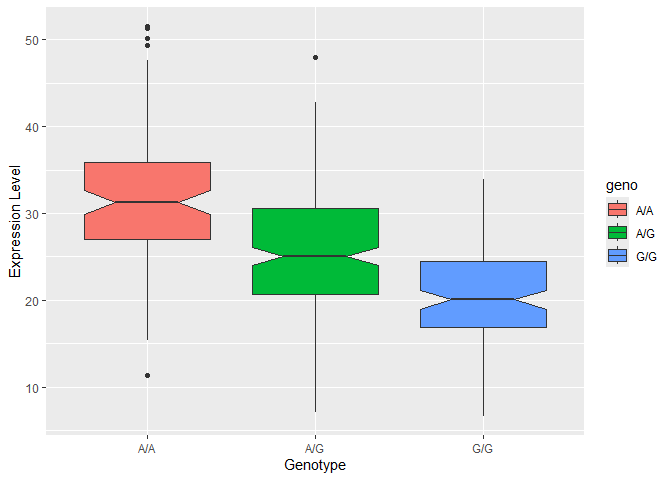

# Class 12: Genome Informatics
Kris Price (PID: A17464127)

> Q13: Read this file into R and determine the sample size for each
> genotype and their corresponding median expression levels for each of
> these genotypes.

``` r
library(tidyverse)
```

    ── Attaching core tidyverse packages ──────────────────────── tidyverse 2.0.0 ──
    ✔ dplyr     1.2.0     ✔ readr     2.2.0
    ✔ forcats   1.0.1     ✔ stringr   1.6.0
    ✔ ggplot2   4.0.2     ✔ tibble    3.3.1
    ✔ lubridate 1.9.5     ✔ tidyr     1.3.2
    ✔ purrr     1.2.1     
    ── Conflicts ────────────────────────────────────────── tidyverse_conflicts() ──
    ✖ dplyr::filter() masks stats::filter()
    ✖ dplyr::lag()    masks stats::lag()
    ℹ Use the conflicted package (<http://conflicted.r-lib.org/>) to force all conflicts to become errors

``` r
samples <- read.table("geno.txt")

table(samples$geno)
```


    A/A A/G G/G 
    108 233 121 

``` r
samples %>%
  group_by(geno) %>%
  summarize(
    median = median(exp)
  )
```

    # A tibble: 3 × 2
      geno  median
      <chr>  <dbl>
    1 A/A     31.2
    2 A/G     25.1
    3 G/G     20.1

The A/A genotype has a sample size of 108 & median expression level of
31.25, A/G has a sample size of 233 & median expression level of 25.06,
and G/G has a sample size of 121 & median expression level of 20.07.

> Generate a boxplot with a box per genotype, what could you infer from
> the relative expression value between A/A and G/G displayed in this
> plot? Does the SNP effect the expression of ORMDL3?

``` r
ggplot(samples, aes(x = geno, y = exp, fill = geno)) +
  geom_boxplot(notch = TRUE) +
  xlab("Genotype") +
  ylab("Expression Level")
```



Yes, it seems like the SNP decreases the expression level of the G
allele of the ORMDL3 gene.
